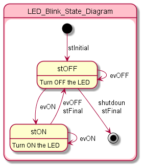
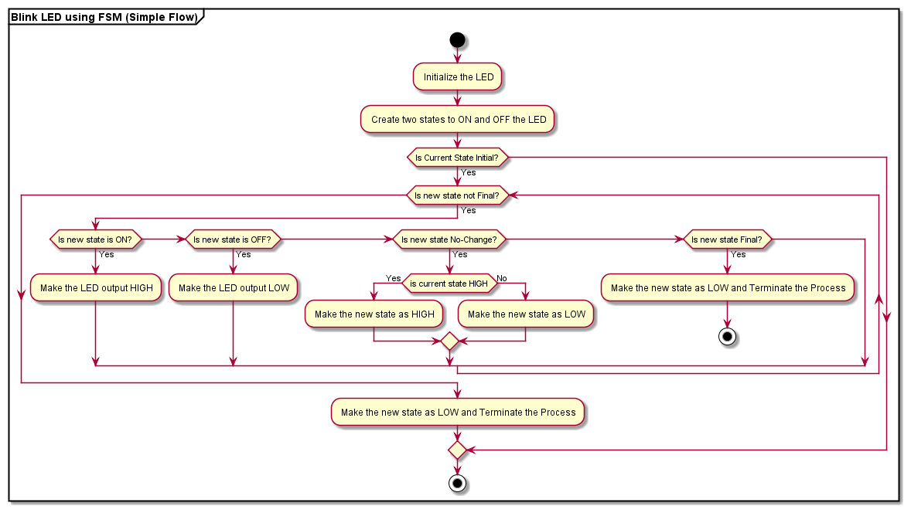

# LED Blink using FSM

This is a simple LED blink using Finite State Machine (FSM). We used Catena4610 board to write the state of the LED and to display those information on a serial monitor.

# Table of Contents
- [Repository Files](#the-repository-consists-of-following-files)
- [State Diagram](#following-is-the-state-diagram-for-led-blink-fsm)
- [Flow Chart](#following-is-the-flowchart-for-the-source)
- [Working](#working)
- [Version](#version)

# The repository consists of following files:

- **Assets:** 

    Assets are flowchart and connection diagram files. We created our flowchart for the task using Plantuml and stored it here. We created our connection diagram using PowerPoint Presentation and stored the image here.

- **Docs:**

    It contains various issues we faced while developing Source for the given task. It is useful for future purpose while debugging a same kind of issue.

- **Source:**

    It is a working source for the task. It can be pulled and modified on any time in future.

# Following is the State Diagram for LED Blink FSM:

- The program consists of 4 states.
    1) stInitial - To initiate the FSM
    2) stON - To turn on the LED
    3) stOFF - To turn off the LED
    4) stFinial - To end the FSM

- The following table shows the current state of LED and events occuring in current state:

    
        State   |    evON     |   evOFF
        --------------------------------------
        OFF     |    LED ON   |   LED OFF      

        ON      |    LED ON   |   LED OFF

# Following is the Flowchart for the Source:

# Working

- As shown in [State Diagram](#following-is-the-state-diagram-for-led-blink-fsm), the LED is LOW at the time when it is initiated. Always Initiation can be done once.

- In LOW state, event OFF does no change to the LED but event ON turns on the LED.

- Similarly in HIGH state, event ON does no change to the LED but event OFF turns off the LED.

- Event shutdown ends the FSM.

# Version:

- LED Blink FSM v1.0.0